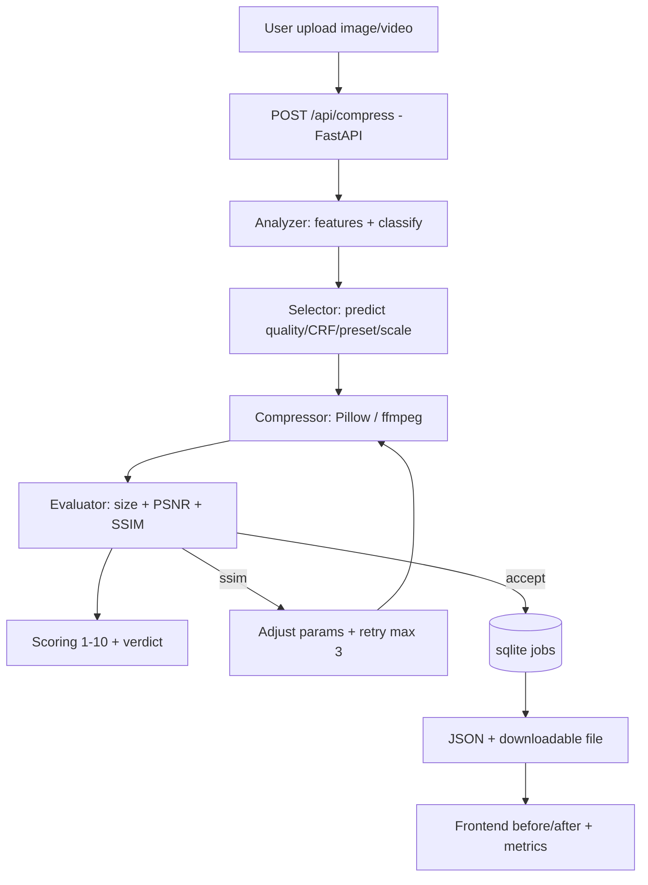
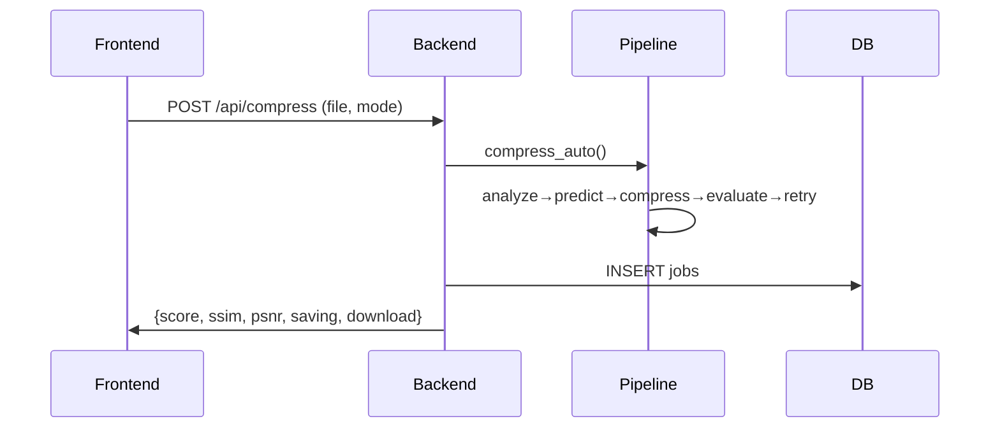

# Flow Diagram

```mermaid
flowchart TD
  U[User upload image/video] --> API[POST /api/compress - FastAPI]
  API --> AN[Analyzer: features + classify]
  AN --> SEL[Selector: predict quality/CRF/preset/scale]
  SEL --> C[Compressor: Pillow / ffmpeg]
  C --> E[Evaluator: size + PSNR + SSIM]
  E --> S[Scoring 1-10 + verdict]
  E -- "ssim<min OR saving<target" --> ADJ[Adjust params + retry max 3]
  ADJ --> C
  E -- accept --> DB[(sqlite jobs)]
  DB --> R[JSON + downloadable file]
  R --> UI[Frontend before/after + metrics]
```

```mermaid
sequenceDiagram
  participant F as Frontend
  participant B as Backend
  participant P as Pipeline
  participant D as DB
  F->>B: POST /api/compress (file, mode)
  B->>P: compress_auto()
  P->>P: analyze→predict→compress→evaluate→retry
  B->>D: INSERT jobs
  B->>F: {score, ssim, psnr, saving, download}
```
